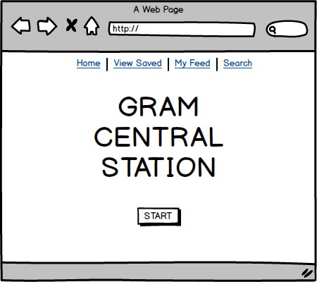
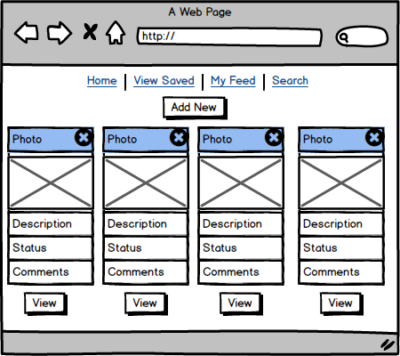
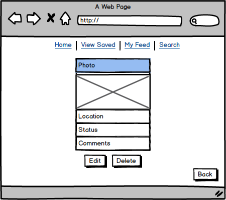
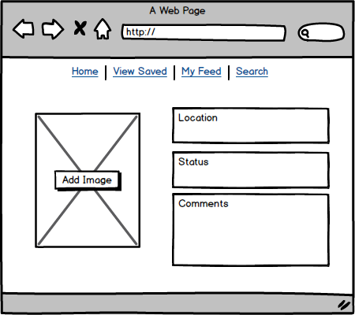
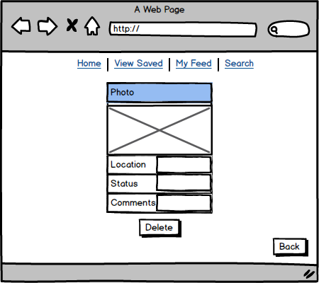
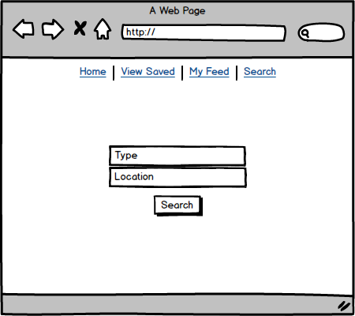
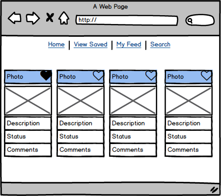
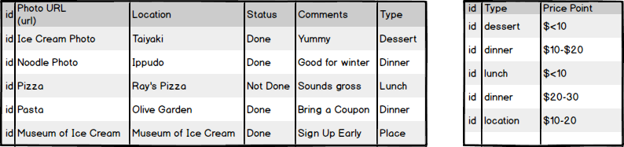

*** Aileen Wong 8/29/17 ***

# Gram Central Station ###

### What is Gram Central Station? ###

Everyone is looking for the next big social media photo. Foodies, wannabe celebs, and normal people are all flocking to the latest hotspot dishing out fish shaped ice cream cones, rainbow cakes and bacon covered everything. 

Unfortunately the market is saturated with rainbow bagels, so Gram Central Station is a place for users to find the next big thing and save it for their next adventures. Users can create their own posts with a photo, description and location. They can also look through a feed of photos to get inspiration. 

### Wireframes ###

#### Home Page ###

#### My Feed ###

#### Single Item ###

#### Add New ###

#### Edit Item ###

#### Search Page ###

#### Search Feed ###

### Initial thoughts on structure ###

(Write out what challenges you expect to encounter, or ideas you want to come up with)

I will need to carefully think about how I'm going to bring images into my feed. I'll source my own instagram for a lot of fun looking treats to seed the database. However, I'll need to figure out how to use an image in a database. My app is photo heavy so the images are important.

#### Database Example ###

Post MVP
I want to use the [Foursquare API](https://developer.foursquare.com/) to be able to generate images and location information. I want the user to be able to put in a zip code or a hashtag to search by hashtag through their API. Upon searching, the app will generate a few images for the user to look through and save any potential food/locations that seem interesting to them.

Other API options:
[Instagram API](https://www.instagram.com/developer/endpoints/)
[Pinterest API](https://developers.pinterest.com/docs/api/pins/)

### Phases of Completion ###

(The steps or phases you expect to go through, and the tasks that you'll need to accomplish to reach each step. These should resemble the acceptance criteria we were working through earlier.)

**Day 1:** First I'll style the basic HTML and CSS and create the database. I want to get the items to generally where I want them to go, but since I'm confident about working on this material by myself, as soon as it looks like it will render things properly like images, I want to move directly to the CRUD app and come back to styling later. 

**Day 2:** At this point, the morning of Day 2 I hope to already be halfway done with my CRUD. My goal by EOD is to be at MVP and started on integrating the API, as that will be the last day I can ask the TAs for help. 

**Day 3:** I want to be working solely with the API and figuring out how to bring in the feed into my own website. I want the user to be able to click on an X on top of the image to delete it and a heart if they like the image. The heart will turn red if it's liked. Upon the click of the heart, the image will also save to the user's own feed and they can view it along with their own generated images. 

**Day 4&5:** Making tweaks, including populating the feed with the API content, adjusting any css & html issues and making things look nice, and perfecting my icon usage system. 

### Links and Resources ###

(Anything you've looked up so far or are thinking about using.)

**Database information:**  
https://www.instagram.com/aileenmwong/?hl=en

**Foursquare API documentation:**  
https://developer.foursquare.com/docs/
